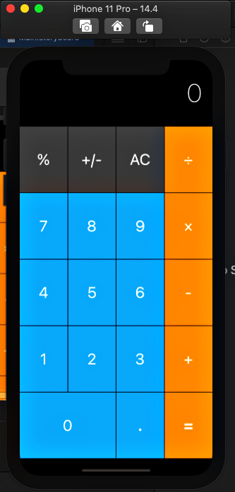
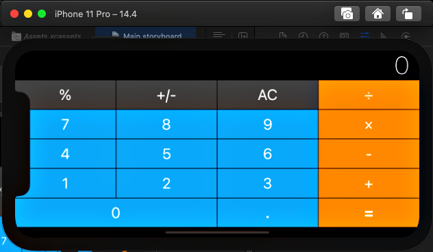
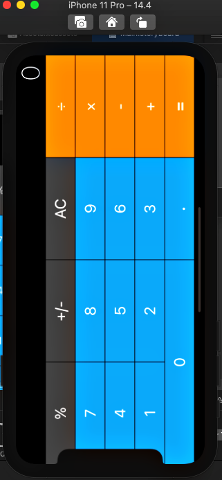
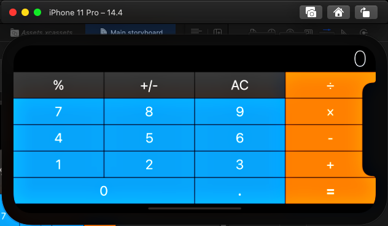

# Calculator with Auto Layout 

## What I Made

A full AutoLayout based app, when we try to rotate the screen to landscape or if we have a screen size that fix this and make this app look exactly the way we want.

## What I learned for making this

* How to add constraints and understanding, how Auto Layout works.
* How to Pin and Align elements.
* How to create containers to configure advanced layouts.
* How to debug auto layout errors.
* Understanding what Xcode needs in order to correctly layout a design.
* How to use Stack Views to create complex interfaces.

## ScreenShot

